<div align="center">


<!-- Typing SVG -->
<a href="https://git.io/typing-svg">
  
</a>

<br/>

<!-- Quick Links -->
<a href="https://cheepheng.github.io">
  
</a>
&nbsp;&nbsp;
<a href="mailto:cheephengcheepheng@outlook.com">
  
</a>
&nbsp;&nbsp;
<a href="https://github.com/CheePheng">
  
</a>

<br/><br/>

</div>

<!-- Divider -->


<br/>

```javascript
// ╔══════════════════════════════════════════════════════════════╗
// ║  $ whoami                                                    ║
// ╚══════════════════════════════════════════════════════════════╝

const cheePheng = {
    education:  "BSc (Hons) Cloud Computing — DkIT 2025",
    languages:  ["TypeScript", "Java", "C#", "C++", "Python", "PHP", "SQL", "Bash"],
    frontend:   ["React", "Vite", "Tailwind CSS", "HTML", "CSS", "Framer Motion"],
    mobile:     ["Ionic", "Electron"],
    backend:    ["Spring Boot", ".NET MVC", "Node.js", "Supabase", "REST APIs"],
    databases:  ["PostgreSQL", "MySQL", "MongoDB"],
    cloud:      ["AWS", "Azure", "Docker", "Linux", "Microservices"],
    tools:      ["Git", "GitHub Actions", "Vercel", "Maven", "JUnit"],
    interests:  ["IoT", "Game Dev", "Cloud Architecture", "Full Stack"],
};
```

<br/>

<!-- Divider -->


<br/>

<div align="center">


<br/><br/>

<a href="https://skillicons.dev">
  
</a>

</div>

<br/>

<!-- Divider -->


<br/>

<!-- Huang Furniture Showcase -->
<div align="center">


<br/><br/>

<table>
<tr>
<td align="center" width="700">

<a href="https://cheepheng.github.io/huang-furniture/">
  
</a>

<br/><br/>


<br/><br/>

<em>A sleek, responsive furniture e-commerce website featuring modern UI design,<br/>product showcases, and smooth user experience.</em>

<br/><br/>

<a href="https://cheepheng.github.io/huang-furniture/">
  
</a>

<br/><br/>

</td>
</tr>
</table>

</div>

<br/>

<!-- Divider -->


<br/>

<!-- Featured Projects -->
<div align="center">


<br/><br/>

<table>
<tr>
<td align="center" width="50%">
  <a href="https://github.com/CheePheng/huang-furniture">
    
  </a>
</td>
<td align="center" width="50%">
  <a href="https://github.com/CheePheng/PartyAI">
    
  </a>
</td>
</tr>
<tr>
<td align="center" width="50%">
  <a href="https://github.com/CheePheng/KinshipPro">
    
  </a>
</td>
<td align="center" width="50%">
  <a href="https://github.com/CheePheng/AiTravelCompanionB">
    
  </a>
</td>
</tr>
<tr>
<td align="center" width="50%">
  <a href="https://github.com/CheePheng/WildSphere-Zoo-">
    
  </a>
</td>
<td align="center" width="50%">
  <a href="https://github.com/CheePheng/IotSimulationAndAggregationSystem">
    
  </a>
</td>
</tr>
</table>

</div>

<br/>

<!-- Divider -->


<br/>

<!-- Custom Terminal Animation -->
<div align="center">



</div>

<br/>

<!-- Footer -->
<div align="center">

<a href="mailto:cheephengcheepheng@outlook.com">
  
</a>
&nbsp;&nbsp;


<br/><br/>


</div>
